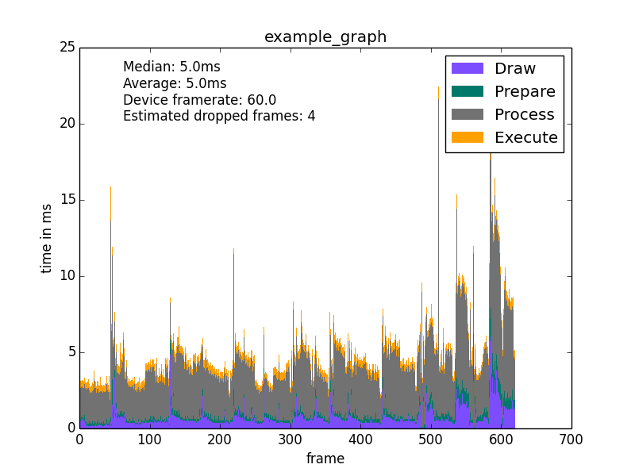

# cookie-butter

Python script for making graphics performance charts for an Android app. To use, enable "Profile GPU rendering" from Developer Options, and restart the app you want to measure. Requires the matplotlib python library. Internally, uses dumpsys for gfxinfo and display via ADB. 

Usage: 

    generate_frametime_graphs.py [-h] package [seconds] [title] [device]

Example: 
    
    python generate_frametime_graphs.py com.google.android.deskclock 5 example_graph 078f1fe513d
    
Output: 

    Median: 5.0ms 
    Average: 5.0ms 
    Device framerate: 60.0 
    Estimated dropped frames: 4

